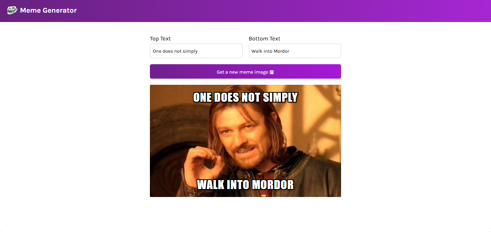

# 😂 Meme Generator

Meme Generator is a web app that allows users to create their own memes by adding custom text to popular meme images! 🎭✨ Built with React and powered by a meme API, it provides a fun and interactive experience.

## 📷 Screenshot


## 🚀 Live Demo
[Coming Soon!](#) *()*

## ✨ Features
- 🎨 **Customizable memes** – Add your own text to meme images
- 🔄 **Fetch random memes** – Get new meme images instantly
- 🖥️ **User-friendly interface** – Simple and easy to use
- 🚀 **Fast and smooth experience** – Built with React

## 🛠️ Tech Stack
- **Frontend:** React, JavaScript, HTML, CSS
- **API:** Meme API for fetching meme images
- **Deployment:** Vercel (or your preferred hosting)

## 📜 Installation & Setup
If you’d like to contribute or run the project locally, follow these steps:

1. **Clone the repository**
   ```bash
   git clone https://github.com/Shamveel-Khan/Meme-Generator.git
